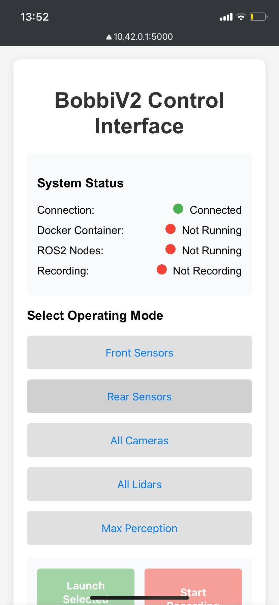
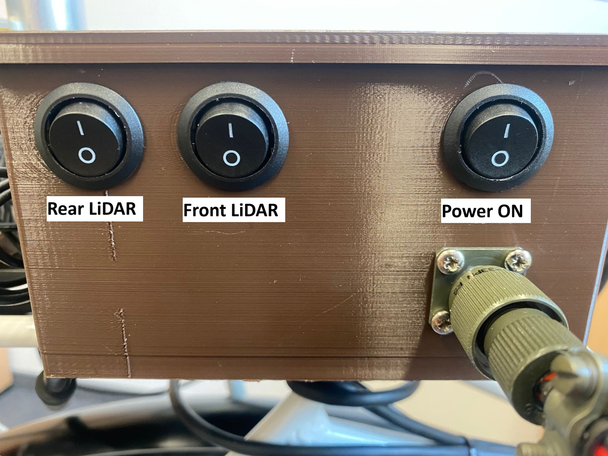
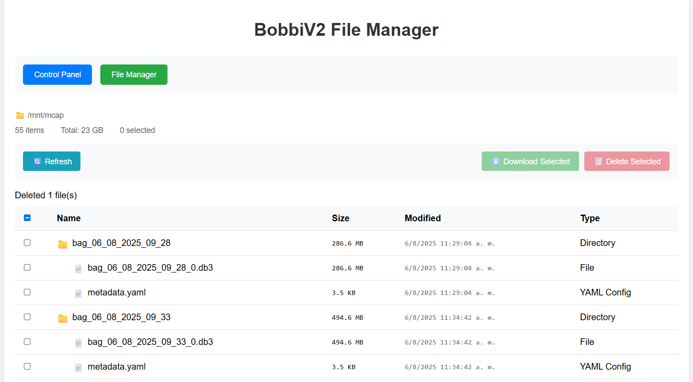

# 🚴‍♂️ BobbiV2 Research Bicycle

BobbiV2 Research Bicycle is an experimental research platform built on a Jetson ORIN AGX embedded system.  
It provides a modular data acquisition framework where different sensor configurations can be launched through a web-based HMI.  
All recorded data is stored in ROS2 bag in `.db3` format and can be downloaded directly from the interface.

---


<p><em>Figure 1: BobbiV2 Research Bicycle</em></p>

## 📦 System Components

- **Jetson Orin AGX** running two Docker containers:
  - [**Web Application (HMI):**](bobbi-web-app/)  Provides a browser-based interface to select operation mode, start/stop recording, and download data.
  - [**ROS2 Drivers Container:**](docker/) Holds all ROS2 drivers and a launch manager to start the sensor stack based on the selected mode.

- **Sensor Hardware Stack**:
  - [Livox Horizon LiDAR](https://www.livoxtech.com/3296f540ecf5458a8829e01cf429798e/assets/horizon/Livox%20Horizon%20user%20manual%20v1.0.pdf) – High-resolution LiDAR for front/rear perception.
  - [ZED X Camera](https://www.stereolabs.com/zed-x/) – Wide FOV stereo camera for visual data.
  - [u-blox GNSS](https://www.u-blox.com/en/product/zed-f9p-module) – High-precision GPS module for localization.
---

## 🌐 Network Access

- **WiFi SSID:** `bobbi-desktop`  
- **Password:** _[to be shared separately]_  
- Once connected, the system is accessible at:  
  `http://10.42.0.1:5000`

---

## ⚙️ Operating Modes

The HMI supports multiple modes of operation:

- **Front Sensors** – Only front-mounted LiDARs and cameras.  
- **Rear Sensors** – Only rear-mounted LiDARs and cameras.  
- **All Cameras** – All camera feeds enabled.  
- **All LiDAR** – All LiDAR sensors enabled.  
- **Max. Perception** – All available sensors enabled simultaneously.  


<p><em>Figure 2: BobbiV2 Control Interface</em></p>

---

## 🚀 How to Use

1. **Power On**  
   - Turn on the Jetson system.  
   - Enable the required sensors (front, rear, or both LiDARs) using the physical switches.
  

<p><em>Figure 3: Power and Sensor Control Buttons</em></p>   

2. **Connect to WiFi**  
   - Connect to the network `bobbi-desktop`.  
   - Use the provided password.  

3. **Access the Web Application**  
   - Open a browser and go to:  
     `http://10.42.0.1:5000`  

4. **Select Operation Mode**  
   - Choose the desired mode (e.g., Front Sensors, All LiDAR, etc.).  
   - Wait for confirmation that the system launched correctly.  

5. **Record Data**  
   - Once the system is running, the **Record** button becomes available.  
   - Click **Start Recording** to capture data.  
   - Click **Stop Recording** to finish.  

6. **Download Data**  
   - Access:  
     `http://10.42.0.1:5000/files`  
   - Download the generated `.db3` files with their respective metadata.  


<p><em>Figure 4: BobbiV2 File Manager</em></p>

---

## 🔧 Managing the System

The BobbiV2 Research Bicycle system comes **pre-installed** and the web application runs automatically on boot.  
If you need to rebuild or update the Docker containers, follow these steps:

1. **Rebuild Docker Images**  
   - After the changes added, use the provided script `build_images` to rebuild both containers.

2. **Stop the Web Application Container**  
   - The web app runs with `--restart unless-stopped` by default. Stop it with:

    ```bash
    docker stop <container_name_or_id>
    ```

3. **Re-launch the Web Application**  

    ```bash
    docker run -d --privileged \
      -v /var/run/docker.sock:/var/run/docker.sock \
      -v /dev/gpiochip0:/dev/gpiochip0 \
      -v /mnt/mcap:/mnt/mcap \
      -p 5000:5000 \
      --restart unless-stopped \
      bobbi-web-app
    ```

4. **Verify**  
   - Access the web app at `http://10.42.0.1:5000` to ensure it starts correctly.

---

## 🛠 Troubleshooting
- **Deeper troubleshooting via SSH**  
  - You can access the Jetson directly using SSH for advanced debugging:

    ```bash
    ssh bobbi@bobbi-desktop
    ```
   - Use the provided password.
  - Once connected, you can inspect logs, manage Docker containers, or check hardware interfaces.

- **Cannot see WiFi network**  
  - Check power source.
  - Ensure Jetson fully booted, it make take a few seconds.

- **Web app not accessible**  
  - Confirm you are connected to `bobbi-desktop`.  
  - Verify the IP: `http://10.42.0.1:5000`.
  - Ensure bobbi-web-app container is running
    ```bash
    docker ps
    ```

- **Data not saving or missing `.db3` files**  
  - Check that `/mnt/mcap` is mounted and writable when launching the web-app container
 


